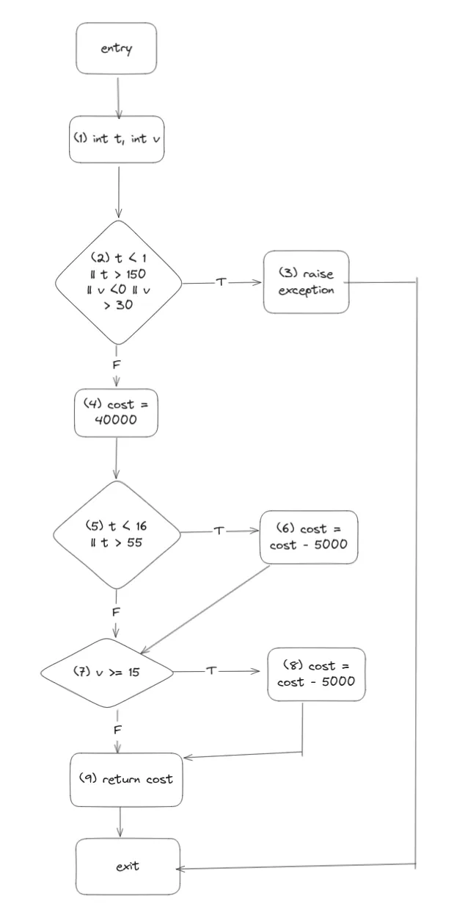

## Bài toán
Bài toán về tính tiền suất cơm tại một quán ăn

**Biến đầu vào**:

- Tuổi (đặt là t), trong đó (1 <= t <= 150)
- Số lần đã tới quán ăn trong 30 ngày gần nhất (đặt là v), trong đó (0 <= v <= 30)

**Đầu ra**:

- Tiền mua suất cơm

**Một số thông tin**:

- Giá một suất ăn là 40,000 VND
- Nếu là trẻ em dưới 16 tuổi hoặc người già trên 55 tuổi sẽ được giảm giá 5 nghìn
- Nếu đã tới quán quán > 15 ngày trong 30 ngày gần nhất (không tính hôm đang tới ăn) sẽ được giảm giá 5 nghìn

## Code (Python) 
Đoạn code tính tiền suất ăn một người phải trả dựa trên tuổi và số lần tới quán ủng hộ

Trích từ file `calc.py`

```python
def calculate_eat_cost(t: int, v: int) -> int:
    if t < 1 or t > 150 or v < 0 or v > 30:
        raise Exception("invalid input")
    
    cost = 40000
    if t < 16 or t > 55:
        cost -= 5000

    if v >= 15: # bug here, correct way: v > 15
        cost -= 5000

    return cost
```

## CFG


## Testing tool 
Sử dụng `pytest` để viết hàm test, set up nhanh

```bash
python3 -m venv venv 
source venv/bin/activate 

pip install pytest
``` 

Sau đó để test ta chạy lệnh sau với flag `-v` là verbose => in kết quả từng ca kiểm thử với bộ tham số tương ứng

```bash
pytest -v
```


## Testing Report

| ID  | Input (t, v) | Expected Output  | Actual Output  | Result |
|----|------------|-----------------|---------------|--------|
| 1  | (0, -1)   | Raise exception | Raise exception | True   |
| 2  | (15, 15)  | 35,000          | 30,000         | False  |
| 3  | (25, 12)  | 40,000          | 40,000         | True   |

